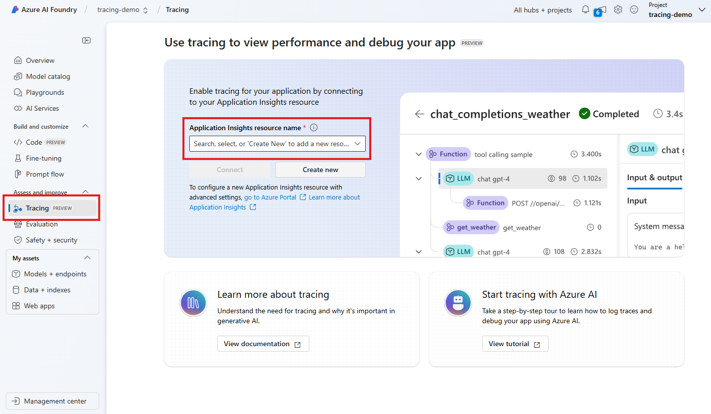
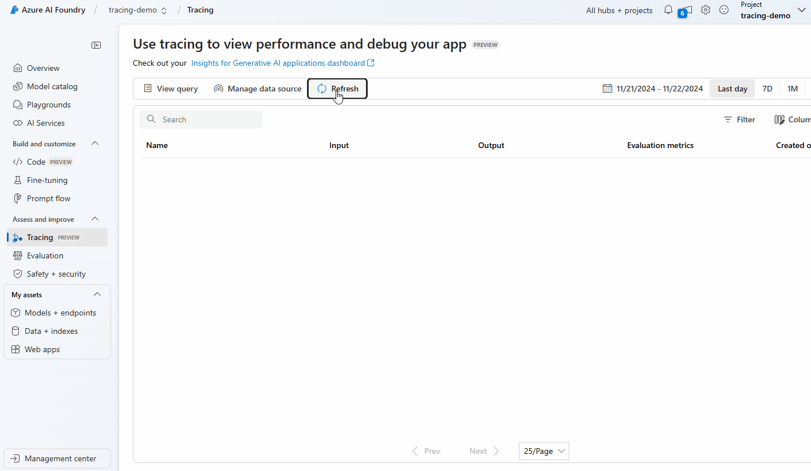

# Visualize traces on Azure AI Foundry Tracing UI

Azure AI Foundry Tracing UI is a web-based user interface that allows you to visualize traces and logs generated by your applications. This article provides a step-by-step guide on how to visualize traces on Azure AI Foundry Tracing UI.

> [!IMPORTANT]
> Before you start, make sure you have completed the tutorial on [inspecting telemetry data with Application Insights](./telemetry-with-app-insights.md).

> [!IMPORTANT]
> This feature is currently only available on Semantic Kernel Python. Support for other languages is coming soon.

Prerequisites:

- An Azure AI Foundry project. Follow this [guide](https://learn.microsoft.com/en-us/azure/ai-studio/how-to/create-projects) to create one if you don't have one.
- A serverless inference API. Follow this [guide](https://learn.microsoft.com/en-us/azure/ai-studio/how-to/deploy-models-serverless) to create one if you don't have one.
- Alternatively, you can attach an Azure OpenAI resource to the project, in which case you don't need to create a serverless API.

## Attach an Application Insights resource to the project

Go to the Azure AI Foundry project, select the **Tracing** tab on the left blade, and use the drop down to attach the Application Insights resource you created in the previous tutorial then click **Connect**.



## Use the Azure AI Inference connector

We are going to replace the chat completion service with the Azure AI Inference connector. This connector will automatically send traces that can be visualized on the Azure AI Foundry Tracing UI.

```python
from semantic_kernel.connectors.ai.azure_ai_inference import AzureAIInferenceChatCompletion

# Create an Azure AI Inference chat completion service with environment variables
kernel.add_service(AzureAIInferenceChatCompletion(ai_model_id="my-deployment", service_id="my-service-id"))

# If you are using an Azure OpenAI endpoint, you can do the following instead.
from azure.ai.inference.aio import ChatCompletionsClient
from azure.identity.aio import DefaultAzureCredential

kernel.add_service(AzureAIInferenceChatCompletion(
    ai_model_id="my-deployment",
    client=ChatCompletionsClient(
        endpoint=f"{str(endpoint).strip('/')}/openai/deployments/{deployment_name}",
        credential=DefaultAzureCredential(),
        credential_scopes=["https://cognitiveservices.azure.com/.default"],
    ),
))
```

Run the script again.

## Visualize traces on Azure AI Foundry Tracing UI

After the script finishes running, head over to the Azure AI Foundry tracing UI. You will see a new trace in the trace UI.



> [!TIP]
> It may take a few minutes for the traces to show up on the UI.

## Next steps

Now that you have successfully visualize trace data with an Azure AI Foundry project, you can explore more features of Semantic Kernel that can help you monitor and diagnose your application:

> [!div class="nextstepaction"]
> [Advanced telemetry with Semantic Kernel](./telemetry-advanced.md)
